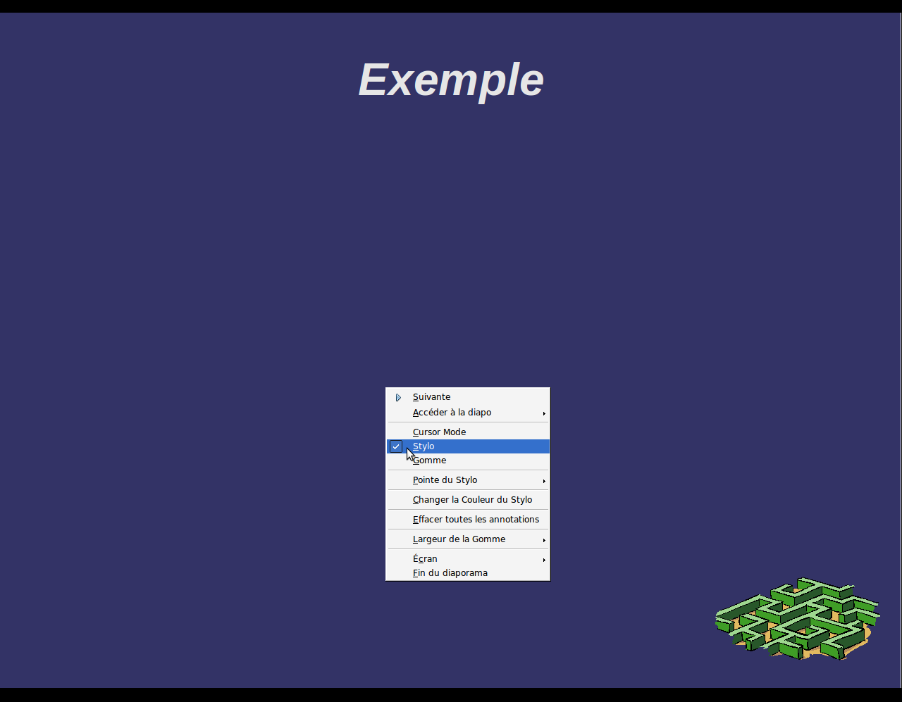
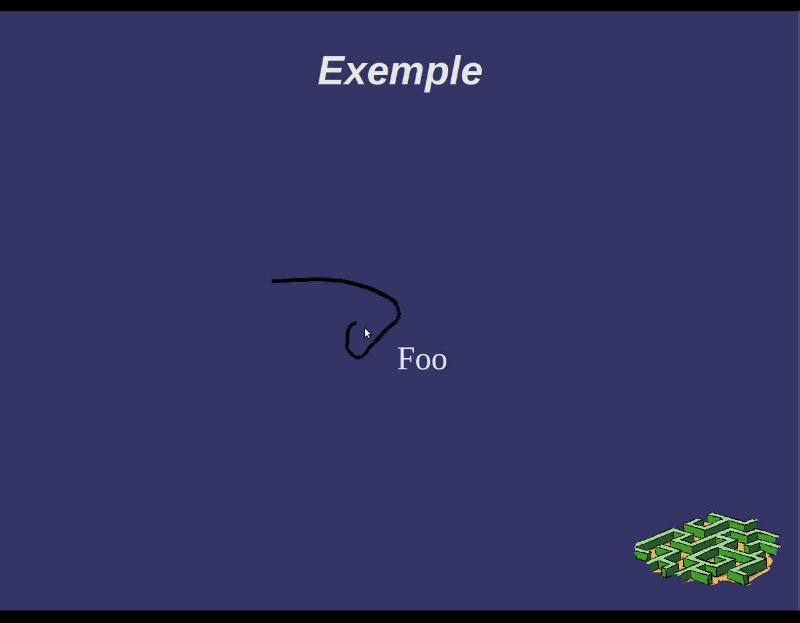

:Info: See  http://wiki.ooo4kids.org/index.php/User:Clementd
       and http://wiki.ooo4kids.org/index.php/User:Bvialle
       for more information
:Author: Benjamin Vialle <Benjamin.Vialle@centraliens-nantes.net>
:Author: Clément Delafargue <clement@delafargue.name>
:Date: $Date: February, 10th 2011 $
:Revision: $Revision: 1 $
:Description: PAPPL on  OpenOffice 4 Kids

================================================================================
Progress Report n°3
================================================================================

.. contents:: Contents

================================================================================
Wiki Completion
================================================================================
We continue to fill our Wiki pages on OOo4Kids wiki :
http://wiki.ooo4kids.org/index.php/User:Bvialle and 
http://wiki.ooo4kids.org/index.php/User:Clementd.

================================================================================
Compilation on GNU/Linux
================================================================================
We still havetrouble with the compilation on Gentoo, due to Gentoo famous quote "It
is important to note that OpenOffice.org is a very fragile build when it comes
to CFLAGS."

We went back to Debian and Ubuntu GNU/Linux distributions. Now everything
compiles fine. It is sad no to be able to continue with Gentoo which is the best
example of compiled source based distribution.

Now, OOo4Kids compiles fine on both Clément's and Benjamin's computers

================================================================================
FOSDEM Attendance
================================================================================
We attended Thorsten Berhens conference on LibreOffice at FOSDEM, untitled
"Impress Hacking". We learned more about how the source files are organized
within the directories.

================================================================================
Done / To be done
================================================================================
We added a new mode, called CM_CURSOR_MODE in *slideshow.src/cxx*.

   New Menu entries

We deleted some booleans and are replacing them with enums. (
mbSwitchPenMode and mbSwitchEraserMode )

   Using the pen

We worked on *sd/source/ui/slideshow/slideshowimpl.cxx/hxx*. We discovered two
classes with *almost* the same name (SlideShowImpl and SlideshowImpl) which are used for
Shlideshow drawing mode.

A new menu entry has been created (still not internationalized (i18n) /
localized (l10n) yet) in *sd/source/ui/slideshow/slideshow.src*.

Moreover, we added several methods : virtual void SAL_CALL setUseCursor(
::sal_Bool _usecursor ) in *sd/source/ui/slideshow/slideshow.hxx* for example.

New bug/feature
================================================================================
A bug with the eraser suddenly appeared. When clicking on eraser menu item,
the eraser icon is loaded but the eraser still behaves like a pen. It seems
like the pen mode is not completely loaded, some parts of the code still act
as if the pen mode was enabled. Last year, students already had the same
issue. We are re-reading reports to find help.

We are running OOo4Kids through gdb to find how we could remove this bug.
